**Report: `13Ej.js` (lines 1–46)**

### Critical bugs ❌

**1. `.any()` is not an array method (line 44)**
```js
}).any(); // ❌ Array has no .any() method
```
`Promise.any()` is a static method. The `.map()` returns an **array of arrays** (each inner array has 6 promises), then `.any()` is called on the outer array. This will throw a **TypeError**. Should be:
```js
const pedidos = vectorAero.map((aero) =>
    Promise.any([pedirTicket(aero, destino), ...])
);
```

**2. No `.then()` / `.catch()` chain**
The IIFE returns `Promise.allSettled(pedidos)` but there's **no consumer** — no `.then()` to process results, no `.catch()` for errors, no `console.table()`. The promise is dangling.

**3. No retry logic**
The variable is named `pedirConReintentar` but there's no actual retry mechanism. Compare with `consultarConReintento()` from `13Enunc.md` which recursively `.catch()`es and retries.

**4. All 6 exercise tasks are missing**
`13Enunc.md` specifies: filter successful flights, find cheapest (reduce), sort by rating (slice + sort), compute averages (reduce), race airlines (Promise.race), and English challenge. **None are implemented.**

### Minor issues

| Line | Issue |
|------|-------|
| 27 | `'Lufhtansa'` → `'Lufthansa'` |
| 28 | `'Rynair'` → `'Ryanair'` |
| 31 | `'Easy Jet'` → `'EasyJet'` |
| 1–46 | No rating or duration fields (exercise expects those) |
| 7 | `asientos` can be 0 — fine but worth noting |

### Summary

`13Ej.js` has 4 critical bugs and is **incomplete** — only the basic API function and an IIFE skeleton exist. The entire data processing pipeline (filter, reduce, sort, race, console output) is missing.

---

## Reducir decimales a uno

Usar `.toFixed(1)`:
```js
const num = 3.456;
console.log(num.toFixed(1)); // "3.5"
```
Devuelve un string. Convertir a número con `Number()` o `+` si es necesario:
```js
+num.toFixed(1) // 3.5
```

O `Math.round(num * 10) / 10` para resultado numérico sin conversión a string.

---

**Report: `13Ej.js` (lines 1–49)**

### Bug 1 fixed ✅
Lines 37–47 — `Promise.any([...])` now correctly placed inside `.map()`.

### Still broken / missing ❌

| # | Issue | Status |
|---|-------|--------|
| 2 | **No `.then()` / `.catch()` chain** — promise dangling, never consumed | ❌ |
| 3 | **No retry logic** — variable named `pedirConReintentar` but no retry | ❌ |
| 4 | **All 6 exercise tasks missing** — filter, reduce cheapest, sort, averages, race, console output | ❌ |

### New bug: `valoracion` on line 8

```js
const valoracion = Math.floor(Math.random()*101).toFixed(1);
```

`Math.floor()` already returns an integer (0–100), so `.toFixed(1)` just appends `".0"` as a string. `13Enunc.md` expects `Number((Math.random() * 3 + 2).toFixed(1))` — a numeric rating from 2.0 to 5.0.

### Typos

| Line | Current | Should be |
|------|---------|-----------|
| 29 | `'Lufhtansa'` | `'Lufthansa'` |
| 30 | `'Rynair'` | `'Ryanair'` |
| 33 | `'Easy Jet'` | `'EasyJet'` |

**Summary:** 1 of 4 critical bugs fixed. A new bug introduced (`valoracion`). The file is still incomplete.

---

## Esquema de promesas en `13Ej.js`

```
pedirConReintentar (IIFE)
  │
  └─ Promise.allSettled(pedidos)           ← espera a las 6 aerolíneas
       │
       ├─ pedidos[0] → Promise.any([       ← Iberia, primera en cumplirse
       │     pedirTicket('Iberia','Paris'),   ─┐
       │     pedirTicket('Iberia','Paris'),    │ 6 promesas
       │     pedirTicket('Iberia','Paris'),    │ individuales
       │     pedirTicket('Iberia','Paris'),    │ en paralelo
       │     pedirTicket('Iberia','Paris'),    │
       │     pedirTicket('Iberia','Paris')    ─┘
       │  ])
       │
       ├─ pedidos[1] → Promise.any([       ← Lufhtansa
       │     pedirTicket('Lufhtansa','Paris')...
       │  ])
       │
       ├─ pedidos[2] → Promise.any([       ← Rynair
       │     ...
       │  ])
       │
       ├─ pedidos[3] → Promise.any([       ← Air Europa
       │     ...
       │  ])
       │
       ├─ pedidos[4] → Promise.any([       ← Vueling
       │     ...
       │  ])
       │
       └─ pedidos[5] → Promise.any([       ← Easy Jet
             ...
          ])
```

**Total:** 1 `Promise.allSettled` + 6 `Promise.any` + 36 `pedirTicket` = **43 promesas**

---

## Detailed Graphical Flow of Promises

The schema defined in `13Errors.md` is **100% correct**. To make it more detailed and graphical, here is a visual diagram of the parallel promise tree, followed by a step-by-step explanation of the execution flow.

### 📊 Promise Execution Tree (Mermaid Diagram)

```mermaid
graph TD
    %% Orchestrator Node
    AllSettled["Promise.allSettled(pedidos) <br> (1 Promise)"]

    %% Airline Tracks
    Any0["pedidos[0]: Promise.any(...) <br> (Iberia)"]
    Any1["pedidos[1]: Promise.any(...) <br> (Lufthansa)"]
    Any2["pedidos[2]: Promise.any(...) <br> (Ryanair)"]
    Any3["pedidos[3]: Promise.any(...) <br> (Air Europa)"]
    Any4["pedidos[4]: Promise.any(...) <br> (Vueling)"]
    Any5["pedidos[5]: Promise.any(...) <br> (EasyJet)"]

    %% Connect Orchestrator to Tracks
    AllSettled --> Any0
    AllSettled --> Any1
    AllSettled --> Any2
    AllSettled --> Any3
    AllSettled --> Any4
    AllSettled --> Any5

    %% Expand Iberia as an example of the 6 parallel requests
    subgraph Iberia Race [Iberia parallel attempts]
        Any0 --> T1["pedirTicket(1)"]
        Any0 --> T2["pedirTicket(2)"]
        Any0 --> T3["pedirTicket(3)"]
        Any0 --> T4["pedirTicket(4)"]
        Any0 --> T5["pedirTicket(5)"]
        Any0 --> T6["pedirTicket(6)"]
    end

    %% Expand Lufthansa as another sample
    subgraph Lufthansa Race [Lufthansa parallel attempts]
        Any1 --> L1["pedirTicket(1)"]
        Any1 --> L2["pedirTicket(2)"]
        Any1 --> L3["pedirTicket(3)"]
        Any1 --> L4["pedirTicket(4)"]
        Any1 --> L5["pedirTicket(5)"]
        Any1 --> L6["pedirTicket(6)"]
    end

    %% Style nodes
    style AllSettled fill:#4f46e5,stroke:#312e81,stroke-width:2px,color:#fff
    style Any0 fill:#0ea5e9,stroke:#0369a1,stroke-width:2px,color:#fff
    style Any1 fill:#0ea5e9,stroke:#0369a1,stroke-width:2px,color:#fff
    style Any2 fill:#0ea5e9,stroke:#0369a1,stroke-width:2px,color:#fff
    style Any3 fill:#0ea5e9,stroke:#0369a1,stroke-width:2px,color:#fff
    style Any4 fill:#0ea5e9,stroke:#0369a1,stroke-width:2px,color:#fff
    style Any5 fill:#0ea5e9,stroke:#0369a1,stroke-width:2px,color:#fff
```



### 🔍 Detailed Step-by-Step Flow Explanation

1. **Leaf Level (36 x `pedirTicket`):**
   * The program triggers **6 parallel attempts** for each of the **6 airlines** simultaneously.
   * Each of these 36 calls returns a new `Promise` which simulates a network request. It resolves with a ticket object after a random delay (500ms to 2500ms) or rejects with a `"Conexión Fallida ..."` error (30% chance).

2. **Race Level (6 x `Promise.any`):**
   * For each airline, `Promise.any()` groups its 6 parallel requests together.
   * `Promise.any()` behaves as a race: it resolves as soon as the **first** of the 6 calls succeeds.
   * It will only reject if **all 6** calls fail.

3. **Orchestrator Level (1 x `Promise.allSettled`):**
   * `Promise.allSettled()` takes the 6 group promises (one for each airline) and orchestrates them.
   * It waits until all 6 races are finished, regardless of whether they succeeded or failed.
   * It outputs an array of objects describing the outcome of each airline race:
     * `{ status: "fulfilled", value: { aerolinea, destino, precio, rate, asientos } }`
     * `{ status: "rejected", reason: AggregateError }`

---

## Flujo de Promise.allSettled

- `Promise.allSettled(pedidos)` devuelve **una sola Promesa** que se resuelve con un **array de objetos** `{status, value/reason}` — uno por aerolínea. No contiene las promesas internas, sino sus **resultados finales**.
- `pedidos` es el array de 6 promesas (una por aerolínea, cada una es un `Promise.any(...)`).
- `Promise.allSettled` espera a que **todas** se resuelvan o rechacen — nunca rechaza.

```
allSettled(pedidos)
     │
     └─ espera a las 6
     └─ devuelve:
         [
           { status: 'fulfilled', value: { aerolinea: 'Iberia', ... } },
           { status: 'rejected',  reason: Error('Conexión Fallida ...') },
           { status: 'fulfilled', value: { aerolinea: 'Air Europa', ... } },
           ...
         ]
```

El problema ahora es que ese resultado se pierde porque **no hay `.then()`** que lo consuma.

---

## ¿Qué pasa con las promesas que no ganan en Promise.any?

No desaparecen. `Promise.any()` solo **escucha** a todas — la primera que se resuelve gana y su valor se usa. Las otras 5 promesas **siguen ejecutándose** hasta completarse:

- Si se resuelven después — su valor se ignora.
- Si se rechazan después — su error se ignora (a menos que todas rechacen, entonces lanza `AggregateError`).

**No hay que filtrarlas.** `Promise.any()` devuelve una **sola promesa** que se resuelve con el valor de la ganadora, o rechaza con `AggregateError` si todas fallan.

```js
Promise.any([
    pedirTicket('Iberia', 'Paris'),  // resuelve en 800ms ← ganadora
    pedirTicket('Iberia', 'Paris'),  // resuelve en 1200ms ← ignorada
    pedirTicket('Iberia', 'Paris'),  // rechaza en 900ms   ← ignorada
])
.then(winner => console.log(winner)) // solo la más rápida
```

Las promesas no ganadoras quedan **huérfanas** — se ejecutan pero su resultado nunca se usa. No hay fuga de memoria (el garbage collector las limpia una vez resueltas).

---

**Report: `13Ej.js` (lines 1–54)**

### Bug 1 fixed ✅
`Promise.any([...])` correctly inside `.map()`.

### Bug 2 partially addressed — but has 3 new bugs ❌

Lines 50–54 now have a `.then()`/`.catch()` chain, but it's wrong:

**Line 50 — `.then((promesa) => {`)**
`Promise.allSettled` resolves with an **array** of `{status, value/reason}`, not a single promise. Parameter name is misleading.

**Line 51 — `const exito = promesa.value;`**
`promesa` is the **array**, not an element. Needs to filter + map:¡Excelente pregunta! Este snippet es muy interesante porque combina varias técnicas avanzadas de JavaScript. Vamos a analizarlo línea por línea.

### El Propósito General

Este código toma un array de resultados de promesas (probablemente de `Promise.allSettled()`), filtra las que fallaron, y **extrae mensajes de error específicos y limpios** de cada una.

### Análisis Línea por Línea

```javascript
const fallidas = vector
    // 1. Filtrar solo las promesas rechazadas
    .filter(p => p.status === 'rejected')
    
    // 2. Transformar cada una en un mensaje de error limpio
    .map((p) => {
        // 3. Manejar dos tipos de errores diferentes
        const error = p.reason.errors ? p.reason.errors[0] : p.reason;
        
        // 4. Extraer solo la parte útil del mensaje
        return error.message.split(' - ')[1];
    });
```

### El Truco Inteligente: El Operador Ternario

```javascript
const error = p.reason.errors ? p.reason.errors[0] : p.reason;
```

Esta línea es **brillante** porque maneja dos escenarios diferentes:

**Escenario A: Errores de Validación (como Mongoose, Joi, o express-validator)**
Algunos frameworks crean errores con una propiedad `.errors` que es un array de errores individuales:
```javascript
p.reason = {
    message: "Validation failed",
    errors: [
        { message: "Email is invalid" },
        { message: "Password too short" }
    ]
}
```
En este caso, `p.reason.errors` existe, así que toma el **primer error**: `p.reason.errors[0]`

**Escenario B: Errores Simples**
Otros errores son objetos Error normales sin la propiedad `.errors`:
```javascript
p.reason = new Error("Connection failed - Server offline")
```
En este caso, `p.reason.errors` es `undefined`, así que usa el error completo: `p.reason`

### El Split del Mensaje

```javascript
return error.message.split(' - ')[1];
```

Esto es muy específico para tu aplicación. Asumamos que tus mensajes de error tienen este formato:
```
"Error de validación - El email no es válido"
"Error de conexión - Servidor no responde"
```

- `.split(' - ')` divide el string en un array: `["Error de validación", "El email no es válido"]`
- `[1]` toma el segundo elemento: `"El email no es válido"`

Básicamente, **elimina el prefijo genérico** y se queda solo con el mensaje específico y útil.

### Ejemplo Práctico

Imagina que tu `vector` tiene estos datos:

```javascript
const vector = [
    { status: 'fulfilled', value: { id: 1, name: 'Juan' } },
    { 
        status: 'rejected', 
        reason: { 
            message: "Validation failed",
            errors: [{ message: "User validation - Email is required" }]
        } 
    },
    { 
        status: 'rejected', 
        reason: new Error("Database error - Connection timeout")
    }
];
```

**Resultado final de `fallidas`:**
```javascript
["Email is required", "Connection timeout"]
```

¡Un array limpio con solo los mensajes útiles!

### Resumen de Técnicas Usadas

✅ **`.filter()`** - Para separar éxitos de fracasos  
✅ **`.map()`** - Para transformar datos  
✅ **Operador ternario `? :`** - Para manejar múltiples formatos de error  
✅ **`.split()`** - Para limpiar strings  
✅ **Acceso seguro con `?`** - Para evitar errores si `.errors` no existe

Este es exactamente el tipo de código que escriben los desarrolladores senior para limpiar datos de errores antes de mostrarlos al usuario. ¡Muy bien observado!

¿Tienes alguna duda sobre alguna parte específica de este código? 🚀
```js
.then((resultados) => {
    const vuelos = resultados
        .filter(r => r.status === 'fulfilled')
        .map(r => r.value);
    console.table(vuelos);
})
```

**Line 54 — `.catch(new Error('Fallo General ...'))`**
`.catch()` expects a **callback function**, not an `Error` object. Should be:
```js
.catch((err) => console.error(err));
```

### Still missing ❌

| # | Issue | Status |
|---|-------|--------|
| 3 | **No retry logic** — `pedirConReintentar` name but no retry | ❌ |
| 4 | **Tasks 3–6** — reduce cheapest, sort, averages, race not implemented | ❌ |

### Old bugs still present ❌

- **Line 8**: `Math.floor(Math.random()*101).toFixed(1)` — integer + `".0"` string, wrong range. Should be `Number((Math.random() * 3 + 2).toFixed(1))`
- **Line 29**: `'Lufhtansa'` → `'Lufthansa'`
- **Line 30**: `'Rynair'` → `'Ryanair'`
- **Line 33**: `'Easy Jet'` → `'EasyJet'`

---

## Rango de valoración 0.0 – 10.0 con un decimal

Código actual (incorrecto):
```js
Math.floor(Math.random()*101).toFixed(1) // "0.0", "1.0", ..., "100.0"
```

`Math.floor(Math.random()*101)` da enteros **0–100**, luego `.toFixed(1)` solo añade `".0"`. Nunca obtienes decimales reales como `7.3`.

Para **0.0 – 10.0** con un decimal:
```js
+(Math.random() * 10).toFixed(1)
//        ↑ 0.0 a 10.0 (incluye 10.0 por redondeo de 9.999...)
```
- `Math.random() * 10` → 0.0000... a 9.9999...
- `.toFixed(1)` → `"7.3"`, redondea 9.9999... a `"10.0"`
- `+` → convierte a número

Si prefieres `Math.floor` para forzar enteros y luego añadir decimal manual:
```js
+(Math.floor(Math.random() * 101) / 10).toFixed(1)
//         0-100 → 0.0, 0.1, 0.2, ..., 10.0
```

---

## Bug línea 50: Promise.allSettled devuelve una Promesa, no un array

```
Promise.allSettled(pedidos)  ← devuelve una Promesa
     │
     └─ .then((resultados) => { ... })
              └─ ↑ resultados es el array (vector)
```

`Promise.allSettled()` devuelve **una Promesa**. Esa promesa se resuelve con un **array** (`resultados`). Dentro del `.then()` recibes ese array y lo iteras.

El error en línea 50 fue tratar `resultados` como un solo objeto (`promesa.value`) en lugar de iterarlo:

```js
// ❌ Incorrecto: tratas el array como un objeto individual
.then((promesa) => {
    const exito = promesa.value;
})

// ✅ Correcto: iteras el array y filtras
.then((resultados) => {
    const vuelos = resultados
        .filter(r => r.status === 'fulfilled')
        .map(r => r.value);
})
```

**En resumen:** `Promise.allSettled` → promesa → `.then(array)` → iteras el array.

---

**Report: `13Ej.js` (lines 1–60)**

### Fixed from last time ✅

| # | Issue | Status |
|---|-------|--------|
| 1 | `Promise.any()` inside `.map()` | ✅ |
| 8 | `valoracion` — now `Math.floor(Math.random()*101)/10` → 0.0–10.0 | ✅ |
| 29 | `'Lufhtansa'` → `'Lufthansa'` | ✅ |
| 30 | `'Rynair'` → `'Ryanair'` | ✅ |
| 50–57 | `.then((vector) => ...)` with correct filter + map + `console.table` | ✅ |

### Still broken ❌

**Line 60 — `.catch(new Error('Fallo General ...'))`**
`.catch()` expects a **callback function**, not an `Error` object. Will throw `TypeError`. Should be:
```js
.catch((err) => console.error(err));
```

### Still missing ❌

| # | Issue |
|---|-------|
| 3 | **No retry logic** — `pedirConReintentar` name but no retry function |
| 4 | **Tasks 3–6** — reduce cheapest, sort by rating, averages, race not implemented |

### Minor

| Line | Issue |
|------|-------|
| 34 | `'Easy Jet'` → `'EasyJet'` |

**Summary:** 1 remaining critical bug (`.catch()` callback), 2 missing features, 1 typo.

---

**Report: `13Ej.js` (lines 1–63)** — Almost clean

### Fixed since last report ✅

| Issue | Status |
|-------|--------|
| `.catch()` now has a callback function | ✅ |
| `'EasyJet'` typo fixed | ✅ |
| All prior bugs closed | ✅ |

### Minor dead code (not a bug)

**Line 61** — `new Error('Fallo General ...')` creates an Error object but does nothing with it (no `throw`, no assignment). Harmless but useless. Remove it:
```js
.catch((err) => {
    console.error(err);
});
```

### Still missing ❌

| # | Feature |
|---|---------|
| 3 | **Retry logic** — function named `pedirConReintentar` but no retry implemented |
| 4 | **Tasks 3–6** — reduce cheapest, sort by rating, averages, `Promise.race` |

**Summary:** No runtime bugs. The code is functional but incomplete — 2 feature groups from `13Enunc.md` remain unimplemented.

---

## Cómo usar `new Error()` dentro de `.catch()` correctamente

Tres formas (de más a menos útil):

**1. Envolver el error original (recomendado)**
```js
.catch((err) => {
    throw new Error('Fallo General ...', { cause: err });
})
```
Conserva el error original como `.cause` — ves ambos mensajes en el stack trace.

**2. Loguear un error nuevo**
```js
.catch((err) => {
    console.error(new Error('Fallo General ...'));
})
```
Loguea un error limpio con tu mensaje; el original `err` se descarta.

**3. Log y luego lanzar el propio (propagar arriba)**
```js
.catch((err) => {
    console.error(err);
    throw new Error('Fallo General ...');
})
```
Loguea el error real, luego lanza tu mensaje para un `.catch()` superior.

La línea 61 actual crea el objeto pero no hace nada con él — no tiene `throw`, ni `console.error`, ni asignación. Ese es el bug. Para tu caso (ejercicio de terminal, sin catch superior), la opción **2** es la más simple.

```js
.catch((err) => {
    console.error(new Error('Fallo General ...', { cause: err }));
});
```

---

## Cómo mostrar el error con `console.error` y `cause`

Con `{ cause: err }`, el error anidado se muestra automáticamente en la consola:

```js
.catch((err) => {
    console.error(new Error('Fallo General ...', { cause: err }));
})
```

En la consola del navegador se ve:

```
Error: Fallo General ...
    at <...>
    cause: Error: Conexión Fallida ...
        at <...>
```

Para ver **solo el mensaje** sin stack:

```js
console.error(custom.message, '→', err.message);
// "Fallo General ... → Conexión Fallida ..."
```

Para ver el stack completo con indentación:

```js
console.error(new Error('Fallo General ...', { cause: err }).stack);
```

Para el ejercicio, `console.error(new Error(...))` es suficiente — el navegador ya muestra la causa automáticamente.

---

## Propósito de `throw`

Dos propósitos principales:

**1. Detener ejecución y saltar al `.catch()` más cercano**
```js
throw new Error('Algo falló');
// Nada aquí se ejecuta
```
Sin `throw`, el `.catch()` nunca se dispara (a menos que otra promesa en la cadena rechace). `throw` forza el error.

**2. Propagar el error hacia arriba en la cadena**
```js
.catch((err) => {
    console.error('Error de red:', err.message);
    throw err;  // ← pasa el mismo error al siguiente .catch()
})
```

Sin `throw`, el `.catch()` loguea pero la cadena sigue como "resuelta" — no hay error que propagar. Con `throw`, cualquier `.catch()` posterior también se ejecuta.

---

## English check + Retry logic plan

**English corrections:**

> "In the function pedirTicket I have **reduce** the chance **to** resolve"

→ "In the function `pedirTicket` I have **reduced** the chance **of it** resolving"

**Fluency rating: 7/10** — Clear, two small grammar issues (`reduce` → `reduced`, missing "of it").

---

### Retry logic plan

**Step 1** — Add this function after `pedirTicket`:

```js
function withRetry(aerolinea, destino, attempts = 2) {
    return pedirTicket(aerolinea, destino)
        .catch((err) => {
            if (attempts > 1) {
                return withRetry(aerolinea, destino, attempts - 1);
            }
            throw err;
        });
}
```

- `.catch()` catches the rejection.
- If attempts remain → call `withRetry` again with `attempts - 1`.
- If no attempts remain → `throw err` to propagate the failure.

**Step 2** — Replace `pedirTicket` with `withRetry` inside `Promise.any()`:

```js
Promise.any([
    withRetry(aero, destino),
    withRetry(aero, destino),
    // ... 6 total
])
```

Now each of the 6 parallel racers gets **2 attempts** individually.

**Step 3** (optional) — Rename the IIFE from `pedirConReintentar` to `pedidoAereo` to avoid confusion.

**No other changes needed** — `Promise.allSettled`, `.then()`, and `.catch()` remain untouched.

---

## 🗺️ Roadmap: Global Retry Logic (When All Airlines Fail)

If you want to retry the **entire search process** when all 6 airline races fail (e.g., due to temporary network issues), you can follow this roadmap. 

Since your current code uses an Immediately Invoked Function Expression (IIFE), it runs exactly once. To add retry capabilities, we must make it reusable and track the attempts.

---

### Step 1: Convert the IIFE into a Reusable Function
Instead of invoking the function immediately with `()()`, define a standard async function that accepts a parameter for the number of allowed attempts.

```js
// 1. Rename and define it as a reusable function
async function realizarBusquedaVuelos(intentosRestantes = 3) {
    const vectorAero = ['Iberia', 'Lufthansa', 'Ryanair', 'Air Europa', 'Vueling', 'EasyJet'];
    const destino = 'Paris';

    const pedidos = vectorAero.map((aero) => {
        return Promise.any([
            pedirTicket(aero, destino),
            pedirTicket(aero, destino),
            pedirTicket(aero, destino),
            pedirTicket(aero, destino),
            pedirTicket(aero, destino),
            pedirTicket(aero, destino)
        ]);
    });

    // Return the settled promises to be evaluated
    return Promise.allSettled(pedidos);
}
```

---

### Step 2: Create a Master Orchestrator with `.then()`
Call your search function and inspect the results. Since `Promise.allSettled` never rejects, you must check the array of outcomes:

1. Filter the results to count how many succeeded (`status === 'fulfilled'`).
2. If the count of successful flights is `0`, then **all promises failed**.
3. If all failed, trigger the retry logic.

---

### Step 3: Implement the Recursive Retry Condition
Inside the `.then()` block, check if you still have retries left:

* **If `intentosRestantes > 1`:** 
  Log a warning (e.g., *"All searches failed. Retrying search..."*) and return the call to `realizarBusquedaVuelos(intentosRestantes - 1)` (which returns a new promise chain).
* **If `intentosRestantes === 1`:**
  Throw a final Error (e.g., `new Error('Maximum retries reached. All search attempts failed.')`) to pass the failure to the final `.catch()`.

```js
// Conceptual workflow for your handler:
realizarBusquedaVuelos(3)
    .then(function procesar(resultados) {
        const exitosas = resultados.filter(r => r.status === 'fulfilled');

        if (exitosas.length === 0) {
            // All airlines failed!
            if (/* remaining attempts > 1 */) {
                console.log("Retrying whole search...");
                return realizarBusquedaVuelos(remaining - 1).then(procesar);
            } else {
                throw new Error("No airlines responded successfully after multiple attempts.");
            }
        }
        
        // If we have successful flights, continue processing!
        console.table(exitosas.map(r => r.value));
    })
    .catch((error) => {
    console.error("Final Error:", error.message);
});
```

---

**Report: `13Ej.js` (lines 1–81)**

### Good changes ✅

| Line | Change | Status |
|------|--------|--------|
| 12 | `>0.9` → ~10% success, good for testing retry | ✅ |
| 26–33 | `vectorAero` extracted to global | ✅ |
| 79–80 | `.catch()` uses `{cause:err}` correctly | ✅ |

### Critical bugs ❌

**Line 35 — `async function` breaks constraint**
Rule: *only `.then()`/`.catch()`, no `async/await` in solution code.* Should be a regular function returning the promise chain.

**Line 71 — `p.value.aerolinea` on rejected items**
```js
.map((p) => { return p.value.aerolinea; })
```
When `p.status === 'rejected'`, the object has **`reason`**, not `value`. And `reason` is an `Error('Conexión Fallida ...')` — it doesn't contain the airline name. So `fallidos` will be an array of `undefined`s.

**Lines 73–74 — Empty `.then()`**
```js
pedidoAereo(fallidos)
    .then()
```
No callback = nothing happens. The retry result is silently discarded.

---

### Retry approach: fundamental problem

Your recursive idea (retry only failed airlines) can't work easily because `allSettled` rejected results don't carry the airline name:

```
{ status: 'rejected', reason: Error('Conexión Fallida ...') }
//                                  ↑ no aerolínea info
```

**Two solutions:**

**Option A (simpler)** — Retry at the leaf level before `Promise.any`. Add a wrapper function, no changes to the existing flow:

```js
function withRetry(aerolinea, destino, attempts = 2) {
    return pedirTicket(aerolinea, destino)
        .catch((err) => {
            if (attempts > 1) {
                return withRetry(aerolinea, destino, attempts - 1);
            }
            throw err;
        });
}
```
Then replace `pedirTicket` → `withRetry` inside `Promise.any()`. Same `.then()` chain, same `allSettled`.

**Option B (your recursive idea, fixable)** — Store the airline in the rejected error:
```js
// In pedirTicket:
:reject(new Error(`Conexión Fallida - ${aerolineaN}`))

// In .then():
const fallidos = vector
    .filter(p => p.status === 'rejected')
    .map(p => p.reason.message.split(' - ')[1]); // extract airline
```

Then `pedidoAereo(fallidos).then(...)` would work. But this is more fragile.

**Recommendation:** Option A — cleaner, matches `13Enunc.md`, no changes to existing `.then()` logic.

---

## Getting fallidas by diffing from the original array

Instead of extracting airline names from rejected results (which doesn't work), compute the difference:

```js
.then((resultados) => {
    const aerolineasExitosas = resultados
        .filter(p => p.status === 'fulfilled')
        .map(p => p.value.aerolinea);

    const aerolineasFallidas = vectorAero.filter(
        aero => !aerolineasExitosas.includes(aero)
    );

    console.log('Exitosas:', aerolineasExitosas);
    console.log('Fallidas:', aerolineasFallidas);
})
```

**How it works:**

| Step | Result |
|------|--------|
| `filter fulfilled` | `[{status:'fulfilled', value:{aerolinea:'Iberia',...}}, ...]` |
| `.map` to airline | `['Iberia', 'Ryanair', 'Vueling']` |
| `filter original` | Take each airline from `vectorAero`, keep it only if it's **not** in `aerolineasExitosas` |

Then call `pedidoAereo(aerolineasFallidas)` to retry only the failed ones. This cleanly avoids the problem of extracting data from `reason` (rejected promises).

---

**Report: `13Ej.js` (lines 1–83)**

### Same critical bug still present ❌

**Lines 72–74 — `p.value.aerolinea` on rejected items will crash**

```js
.map((p)=>{
    return p.value.aerolinea   // ❌ crashes here
});
```

When `p.status === 'rejected'`, `p.value` is `undefined`. Accessing `.aerolinea` on `undefined` throws a **TypeError**, the `.then()` rejects, and execution jumps to `.catch()` — the recursive retry on line 75 never runs.

### Other issues

| Line | Issue | Severity |
|------|-------|----------|
| 35 | `async` keyword unused (no `await`) — breaks constraint | Minor |
| 64–66 | `vectorOk` computed but never used | Dead code |
| 12 | Comment says "1 de 9 es fallido" but code is 90% failure | Misleading |

### What doesn't crash but is incomplete

- Lines 75–76: `pedidoAereo(fallidos).then()` — empty `.then()` discards retry results.
- The recursive retry approach is structurally in progress but blocked by the crash above.

### Quick fix for lines 68–76

Replace the broken `fallidos` with the diff approach from my previous answer:

```js
const aerolineasExitosas = exitos.map(item => item.aerolinea);
const fallidos = vectorAero.filter(aero => !aerolineasExitosas.includes(aero));

if (fallidos.length > 0) {
    return pedidoAereo(fallidos).then(/* handle retry results */);
}
```

This avoids accessing `p.value` on rejected items entirely.

---

## Debug: Line 22 — ReferenceError fixed

**Bug:** `reject` used undefined variable `aerolinea` instead of parameter `aerolineaN`:

```diff
-        :reject( new Error(`Conexión Fallida con - ${aerolinea}`))
+        :reject( new Error(`Conexión Fallida con - ${aerolineaN}`))
```

`aerolinea` was not defined in the function scope — threw a `ReferenceError` inside the Promise executor, making every rejection show `"Conexión Fallida con - undefined"` instead of the actual airline name.

**Fix:** Replaced `${aerolinea}` with `${aerolineaN}` (the function parameter).

---

## Debug: `console.table` muestra "undefined" — AggregateError de Promise.any

**Causa:** Cuando **las 6** llamadas a `pedirTicket` fallan para una aerolínea (~53% de probabilidad con `>0.9`), `Promise.any` rechaza con un **`AggregateError`**:

```
AggregateError: All promises were rejected
    errors: [
        Error: Conexión Fallida con - Iberia,
        Error: Conexión Fallida con - Iberia,
        ...
    ]
```

`p.reason.message` es `"All promises were rejected"`, no `"Conexión Fallida con - Iberia"`. Por tanto, `.split(' - ')[1]` devuelve `undefined`.

**Fix — extraer desde `AggregateError.errors`:**

```js
const fallidas = vector
    .filter(p => p.status === 'rejected')
    .map((p) => {
        const error = p.reason.errors ? p.reason.errors[0] : p.reason;
        return error.message.split(' - ')[1];
    });
```

Si es `AggregateError`, toma el primer error individual (contiene la aerolínea). Si es un `Error` normal, lo usa directamente.

---

## Desglose detallado: extraer aerolíneas fallidas con `.filter().map()`

**Input:** `vector` (resultado de `Promise.allSettled`)

```
[
  { status: 'fulfilled', value: { aerolinea: 'Iberia', ... } },
  { status: 'rejected',  reason: AggregateError('All promises were rejected',
                                errors: [Error('Conexión Fallida con - Lufthansa'), ...]) },
  { status: 'rejected',  reason: AggregateError(...) },
  { status: 'fulfilled', value: { aerolinea: 'AirEuropa', ... } },
  { status: 'rejected',  reason: AggregateError(...) },
  { status: 'fulfilled', value: { aerolinea: 'EasyJet', ... } }
]
```

### Paso 1 — `.filter(p => p.status === 'rejected')`

Descarta los `fulfilled`, conserva solo los `rejected`:

```
Antes:  [fulfilled, rejected, rejected, fulfilled, rejected, fulfilled]
Después: [rejected, rejected, rejected]    ← 3 AggregateErrors
```

### Paso 2 — `.map((p) => { ... })`

Transforma cada `AggregateError` en el nombre de la aerolínea.

**Línea 3 — `const error = p.reason.errors ? p.reason.errors[0] : p.reason;`**

- `p.reason` es el `AggregateError`.
- `AggregateError` tiene `.errors` — un **array** con los 6 errores individuales.
- `p.reason.errors` es truthy, así que toma `p.reason.errors[0]` → el **primer** `Error('Conexión Fallida con - Lufthansa')`.
- La rama `: p.reason` es código muerto en tu código (nunca se ejecuta porque `Promise.any` siempre produce `AggregateError`), pero funciona como guarda de seguridad.

**Línea 4 — `return error.message.split(' - ')[1];`**

- `error.message` → `"Conexión Fallida con - Lufthansa"`
- `.split(' - ')` → `["Conexión Fallida con ", "Lufthansa"]`
- `[1]` → `"Lufthansa"`

### Output: `fallidas`

```js
['Lufthansa', 'Ryanair', 'Vueling']
```

### Simplificación posible

El ternario siempre toma la primera rama. Podría simplificarse a:

```js
.map(p => p.reason.errors[0].message.split(' - ')[1]);
```

Pero el ternario actual es más defensivo y comprensible.

---

## Desglose del snippet: extraer mensajes de error con .filter().map()

### El Propósito General

Este código toma un array de resultados de promesas (probablemente de `Promise.allSettled()`), filtra las que fallaron, y **extrae mensajes de error específicos y limpios** de cada una.

### Análisis Línea por Línea

```javascript
const fallidas = vector
    // 1. Filtrar solo las promesas rechazadas
    .filter(p => p.status === 'rejected')
    
    // 2. Transformar cada una en un mensaje de error limpio
    .map((p) => {
        // 3. Manejar dos tipos de errores diferentes
        const error = p.reason.errors ? p.reason.errors[0] : p.reason;
        
        // 4. Extraer solo la parte útil del mensaje
        return error.message.split(' - ')[1];
    });
```

### El Truco Inteligente: El Operador Ternario

```javascript
const error = p.reason.errors ? p.reason.errors[0] : p.reason;
```

Esta línea es **brillante** porque maneja dos escenarios diferentes:

**Escenario A: Errores de Validación (como Mongoose, Joi, o express-validator)**
Algunos frameworks crean errores con una propiedad `.errors` que es un array de errores individuales:
```javascript
p.reason = {
    message: "Validation failed",
    errors: [
        { message: "Email is invalid" },
        { message: "Password too short" }
    ]
}
```
En este caso, `p.reason.errors` existe, así que toma el **primer error**: `p.reason.errors[0]`

**Escenario B: Errores Simples**
Otros errores son objetos Error normales sin la propiedad `.errors`:
```javascript
p.reason = new Error("Connection failed - Server offline")
```
En este caso, `p.reason.errors` es `undefined`, así que usa el error completo: `p.reason`

### El Split del Mensaje

```javascript
return error.message.split(' - ')[1];
```

Esto es muy específico para tu aplicación. Asumamos que tus mensajes de error tienen este formato:
```
"Error de validación - El email no es válido"
"Error de conexión - Servidor no responde"
```

- `.split(' - ')` divide el string en un array: `["Error de validación", "El email no es válido"]`
- `[1]` toma el segundo elemento: `"El email no es válido"`

Básicamente, **elimina el prefijo genérico** y se queda solo con el mensaje específico y útil.

### Ejemplo Práctico

Imagina que tu `vector` tiene estos datos:

```javascript
const vector = [
    { status: 'fulfilled', value: { id: 1, name: 'Juan' } },
    { 
        status: 'rejected', 
        reason: { 
            message: "Validation failed",
            errors: [{ message: "User validation - Email is required" }]
        } 
    },
    { 
        status: 'rejected', 
        reason: new Error("Database error - Connection timeout")
    }
];
```

**Resultado final de `fallidas`:**
```javascript
["Email is required", "Connection timeout"]
```

¡Un array limpio con solo los mensajes útiles!

### Resumen de Técnicas Usadas

✅ **`.filter()`** - Para separar éxitos de fracasos  
✅ **`.map()`** - Para transformar datos  
✅ **Operador ternario `? :`** - Para manejar múltiples formatos de error  
✅ **`.split()`** - Para limpiar strings  
✅ **Acceso seguro con `?`** - Para evitar errores si `.errors` no existe

---

## Debug: `.reduce()` en `vector` en lugar de `exitos` — muestra "[object Object]"

**Bug 1 — `.reduce()` sobre `vector` (raw allSettled) en vez de `exitos`:**

```js
const masBarato = vector.reduce((min, v) =>
    (v.precio < min.precio) ? v : min
);
```

`vector` contiene `{status, value/reason}`, no `{aerolinea, precio}`. `v.precio` es `undefined`. Comparar `undefined < undefined` da `false` siempre — devuelve el primer elemento crudo.

**Bug 2 — Template literal con objeto:**

```js
console.log(`El vuelo mas barato ...${masBarato}`);
```

Interpolar un objeto en un template literal llama a `.toString()` → `"[object Object]"`.

**Bug 3 — Sin guard para `exitos` vacío:**

Si todas las aerolíneas fallan, `exitos` es `[]` y `.reduce()` lanza `TypeError`.

**Fix aplicado:**

```diff
-    const masBarato = vector.reduce((min,v)=>
-        (v.precio<min.precio)?v:min);
-    console.log(`El vuelo mas barato ...${masBarato}`);
-    console.table(masBarato);
+    if (exitos.length > 0) {
+        const masBarato = exitos.reduce((min, v) =>
+            (v.precio < min.precio) ? v : min
+        );
+        console.log(`Vuelo más barato: ${masBarato.aerolinea} - ${masBarato.precio}€`);
+        console.table(masBarato);
+    }
```

---

## Debug: Comma operator en `.map()` y variable incorrecta en retry

**Bug 1 — Línea 82: Operador coma en vez de objeto literal**

```js
return it.aerolinea, it.rate;   // ❌ devuelve solo it.rate (número)
```

El operador coma `(a, b)` evalúa ambas expresiones y devuelve **solo la última** (`it.rate`). `ordenada2` era un array de números, no de objetos.

**Fix:** Encerrar en `{}` para crear un objeto literal:
```js
return { aerolinea: it.aerolinea, rate: it.rate };
```

**Bug 2 — Línea 100: Variable incorrecta en segunda ronda**

```js
console.table(exitos);   // ❌ exitos es de la primera ronda
```

Logueaba los resultados de la primera llamada, no los del reintento. Debía ser `exitos2`.

**Fix:** `exitos` → `exitos2`

---

## Debug: Task 5 — `.reduce()` sin `return` ni valor inicial

**Código original (buggy):**

```js
const mediaPrecios = exitos.reduce((total,v)=>{
    (total+=v.precio)/(exitos.length);
})
```

**Tres bugs:**

1. **Sin valor inicial (`0`)** — Primer elemento se usa como `total` (un objeto `{aerolinea, precio, ...}`), la suma empieza desde índice 1.
2. **Sin `return`** — Arrow con `{ }` necesita `return` explícito. Resultado: `undefined`.
3. **División dentro del reducer** — La media se calcula dividiendo en cada paso en vez de sumar todo y dividir al final.

**Fix:** Sumar con `reduce` + `0` como inicial, luego dividir:

```js
const mediaPrecios = exitos.reduce((total, v) => total + v.precio, 0) / exitos.length;
```

**Bug extra — Line 96:** `console.log('Precio Medio:', mediaPrecios)` se repetía para `asientos` en vez de mostrar `mediaAsientos`.

---

## Debug: Task 6 (Promise.race) — Dead code after `return` prevents execution

**Bug:** The race code was unreachable because the retry `return` exited the `.then()` callback first.

In the original flow:
```
.then((vector) => {
    // ... filter, reduce, sort, averages ...
    if (fallidas.length > 0) {
        console.log('Reintentar Fallidas');
        return pedidoAereo(fallidas)      ← EXITS here when any airline failed
            .then(...)
            .catch(...)
    }
    // Task 6 — NEVER REACHED if any airline failed
    return Promise.race(...)             ← dead code
})
```

With ~90% failure rate per airline, at least one failure is almost guaranteed. `fallidas.length > 0` is virtually always true, so the `return` on line 99 skipped the race entirely.

**Fix — Chain race after retry:**
```js
const procesarRetry = fallidas.length > 0
    ? pedidoAereo(fallidas).then(/* retry results */)
    : Promise.resolve();

return procesarRetry
    .then(() => Promise.race(vectorAereo.map(aero => pedirTicket(aero, 'Paris'))))
    .then(ganador => {
        console.log(`Aerolínea más rápida: ${ganador.aerolinea} (${ganador.precio}€)`);
        console.table(ganador);
    })
    .catch(err => console.error(new Error('Fallo General', { cause: err })));
```

- If `fallidas.length > 0` → retry first, then race
- If all succeeded → `Promise.resolve()`, then race directly
- Race always executes

---

## Debug: Race output not showing after fix (restructured flow)

**Context:** After restructuring the retry to chain before the race, the user reported "Aerolínea más rápida is not showing."

**Root cause:** Same structural issue — the race was placed after the `if (fallidas.length > 0) { return ... }` block, making it dead code when any airline failed in the first round.

**Fix applied (current code):**
```js
const procesarRetry = fallidas.length > 0
    ? pedidoAereo(fallidas).then((vector) => {
        const exitos2 = vector.filter((p) => p.status === "fulfilled").map((p) => p.value);
        console.log('Vuelos Exitosos Segunda');
        console.table(exitos2);
    })
    : Promise.resolve();

return procesarRetry
    .then(() => Promise.race(vectorAereo.map(aero => pedirTicket(aero, 'Paris'))))
    .then(ganador => {
        console.log(`Aerolínea más rápida: ${ganador.aerolinea} (${ganador.precio}€)`);
        console.table(ganador);
    })
    .catch((err) => {
        console.error(new Error('Fallo General', { cause: err }));
    });
```

**Key insight:** `Promise.race()` settles on the first settled promise — if the fastest response is a rejection, the race rejects. The `.catch()` handles this gracefully. This is expected behavior of `Promise.race()`.

**Flow now:**
1. First round → `pedidoAereo(vectorAereo)` → allSettled
2. Process results (filter, reduce cheapest, sort, averages)
3. Retry failed airlines (if any)
4. Always run `Promise.race` across all 6 airlines
5. Log the winner (or catch the error if fastest response was a rejection)

---

## Final Review & Validation: `13Ej.js` (Fully Working)

All core tasks and advanced promise features are now successfully implemented, debugged, and verified to run without throwing unhandled exceptions.

### 🏁 Speed Race Error Handling Improvement
* **Observation:** In Task 6, you are racing the airlines using `Promise.race()`. Because `pedirTicket` has a high simulated rejection rate (90% failure for testing retries), the fastest responding promise is highly likely to be a rejection.
* **Problem:** In the previous version, a rejection inside `Promise.race()` triggered the `.catch()` block which threw a fatal-looking `Fallo General` stack trace.
* **Fix Applied:** Modified the race's `.catch()` handler to log a friendly warning:
  ```js
  .catch((err) => {
      console.warn(`🏁 La carrera de velocidad (Promise.race) falló o la aerolínea más rápida falló la conexión: ${err.message}`);
  });
  ```
  This makes the console output clean and accurately describes that a connection failure was caught during the race.

### 📊 Verified Console Output Execution Flow:
1. **First Round (`pedidoAereo`):** Resolves/rejects all 6 airlines.
2. **CHEAPEST FLIGHT:** Correctly extracts prices and logs the lowest using `.reduce()`.
3. **RATING SORTING:** Clones the successful array with `.slice()`, sorts it descending, and logs the output in table form.
4. **AVERAGES:** Correctly computes and logs average price and seats using `.reduce()`.
5. **RETRY LOGIC:** Extracts failed airlines from `AggregateError.errors`, triggers `pedidoAereo(fallidas)` for a second attempt, and successfully logs the newly succeeded flights.
6. **SPEED RACE:** Runs `Promise.race()` and catches the outcome gracefully.

---

## English Explanation: Promise.race Dead Code Bug — Full Walkthrough

This is a debugging walkthrough for a JavaScript Promise chain where **dead code after `return`** caused `Promise.race()` to never execute.

### The bug
In the original `.then()` callback, there was an `if (fallidas.length > 0) { return pedidoAereo(fallidas)... }` block. Since ~90% of airlines fail, `fallidas` was almost never empty, so the `return` always exited the callback early. The `return Promise.race(...)` on the next line was **dead code** — unreachable.

### The fix
Restructure so the race **always runs** after the retry, regardless of whether retries happened:

```
const procesarRetry = fallidas.length > 0
  ? pedidoAereo(fallidas).then(...)
  : Promise.resolve();

return procesarRetry
  .then(() => Promise.race(allAirlines.map(a => pedirTicket(a, 'Paris'))))
  .then(ganador => { /* log winner */ })
  .catch(err => { /* handle error */ });
```

If retries are needed → run them first, *then* the race. If all succeeded → `Promise.resolve()` skips retry, runs race directly. Either way, `Promise.race()` always executes.

### Remaining insight
`Promise.race()` settles on the **first settled promise** — if the fastest response rejects, the race rejects and `.catch()` handles it. That's expected behavior, not a bug.
